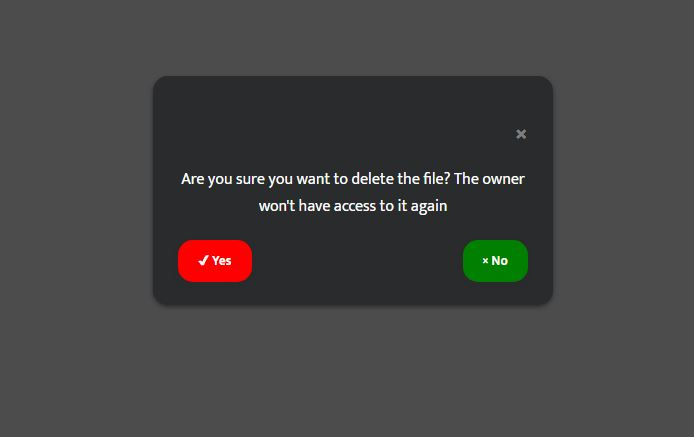

# confirmo
A lightweight front-end confirmation library that helps you to get confirmations before actions are taken on your web apps

    <center>
        
    </center>

## Installation/Usage
To use confirmo in your project, simply add the links to the CSS and JS source files which are included in the source code, named confiro.css and confirmo.js respectively.
```html
<link rel="stylesheet" type="text/css" href="./src/confirmo.css"/>
<script type="text/javascript" src="./src/confirmo.js"></script>
```
Once this is done, you are able to define your confirmation modals with either HTML attributes or JavaScript. Ideally (at default), to initialize the modal, you use:
```js
confirmo.init(options)
```
Where options represents an object containing configuration and design properties of the modal. There are a lot of them which will be discussed soon in this documentation.
